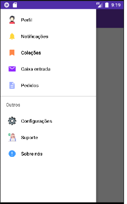
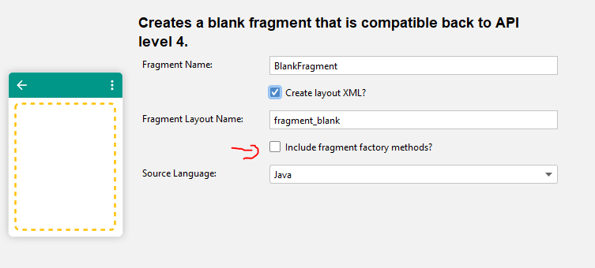
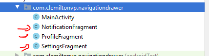
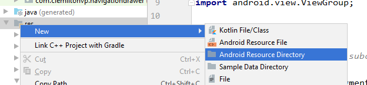
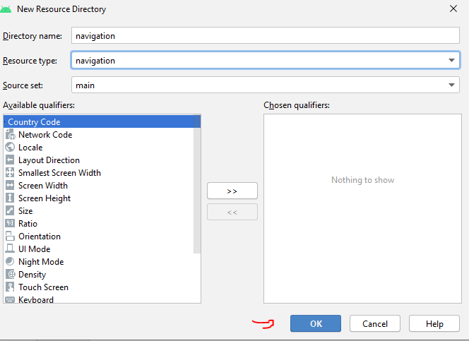

# Navigation Drawer
### Projeto implementado: https://github.com/clemiltonfucapi/DispositivosMoveisII/raw/main/NavigationDrawer/NavigationDrawer.rar

# 
- Criar um novo projeto com o template `Empty Activity`
- Adicionar em `build.gradle (Module:app)` e sincronizar o projeto:
```javascript

dependencies {
    ...
    //Material Design
    implementation 'com.google.android.material:material:1.2.0'
    //Rounded Image View
    implementation 'com.makeramen:roundedimageview:2.3.0'
    //Navigation component
    implementation 'androidx.navigation:navigation-fragment-ktx:2.2.0-rc03'
    implementation 'androidx.navigation:navigation-ui-ktx:2.2.0-rc03'
}
```

- Modificar o estilo da activity em `values/styles.xml`:
```xml
!-- Base application theme. -->
    <style name="AppTheme" parent="Theme.MaterialComponents.Light.NoActionBar">
        <!-- Customize your theme here. -->
        <item name="colorPrimary">@color/colorPrimary</item>
        <item name="colorPrimaryDark">@color/colorPrimaryDark</item>
        <item name="colorAccent">@color/colorAccent</item>
    </style>
```
- Modificar as cores do app em `values/colors.xml`
```xml
<?xml version="1.0" encoding="utf-8"?>
<resources>
    <color name="colorPrimary">#673AB7</color>
    <color name="colorPrimaryDark">#512DA8</color>
    <color name="colorAccent">#FF5252</color>
    <color name="colorPrimaryText">#212121</color>
    <color name="colorWhite">#FFFFFFF</color>
    <color name="colorGreen">#32CD32</color>
</resources>
```
- Adicionar um ícone no projeto: (`drawable/ic_menu_black_24dp.xml`):
```XML
<vector xmlns:android="http://schemas.android.com/apk/res/android"
        android:width="24dp"
        android:height="24dp"
        android:viewportWidth="24.0"
        android:viewportHeight="24.0">
    <path
        android:fillColor="#FF000000"
        android:pathData="M3,18h18v-2L3,16v2zM3,13h18v-2L3,11v2zM3,6v2h18L21,6L3,6z"/>
</vector>
```
- Adicionar o seguinte codigo em activity_main.xml:

```XML
<?xml version="1.0" encoding="utf-8"?>
<androidx.drawerlayout.widget.DrawerLayout xmlns:android="http://schemas.android.com/apk/res/android"
    xmlns:app="http://schemas.android.com/apk/res-auto"
    xmlns:tools="http://schemas.android.com/tools"
    android:id="@+id/drawerLayout"
    android:layout_width="match_parent"
    android:layout_height="match_parent"
    tools:context=".MainActivity">
    <androidx.constraintlayout.widget.ConstraintLayout
        android:layout_width="match_parent"
        android:layout_height="match_parent">
        <LinearLayout
            android:id="@+id/layoutToolBar"
            android:layout_width="0dp"
            android:layout_height="?actionBarSize"
            android:background="@color/colorPrimary"
            android:orientation="horizontal"
            android:paddingStart="15dp"
            android:gravity="center_vertical"
            android:paddingEnd="15dp"
            app:layout_constraintEnd_toEndOf="parent"
            app:layout_constraintStart_toStartOf="parent"
            app:layout_constraintTop_toTopOf="parent" >
            <ImageView
                android:layout_width="30dp"
                android:layout_height="30dp"
                android:id="@+id/imageMenu"
                android:src="@drawable/ic_menu_black_24dp"
                android:contentDescription="@string/app_name"
                android:tint="@color/colorWhite"
                />
            <TextView
                android:id="@+id/textTitle"
                android:layout_width="match_parent"
                android:layout_height="wrap_content"
                android:layout_marginStart="15dp"
                android:text="@string/app_name"
                android:textColor="@color/colorWhite"
                android:textSize="18sp"
                android:textStyle="bold"
                />
        </LinearLayout>    
    </androidx.constraintlayout.widget.ConstraintLayout>
</androidx.drawerlayout.widget.DrawerLayout>
```
- O layout deve ficar da seguinte maneira:

    

- Agora adicione um navigationView depois do ConstraintLayout:
    ```xml
    ....
        </androidx.constraintlayout.widget.ConstraintLayout>
        <com.google.android.material.navigation.NavigationView
            android:id="@+id/navigationView"
            android:layout_width="wrap_content"
            android:layout_height="match_parent"
            android:layout_gravity="start" />
    </androidx.drawerlayout.widget.DrawerLayout>
    ```
- Execute o app e verique o comportamento, ao arrastar o cursor
da esquerda p/ direita:

   <center></center>

- Adicionar um evento de clique no botão de menu ``MainActivity.java``
    ```java
        @Override
        protected void onCreate(Bundle savedInstanceState) {
            super.onCreate(savedInstanceState);
            setContentView(R.layout.activity_main);

            final DrawerLayout drawerLayout = findViewById(R.id.drawerLayout);

            findViewById(R.id.imageMenu).setOnClickListener(new View.OnClickListener() {
                @Override
                public void onClick(View view) {
                    //Mostrar o navigation view
                    drawerLayout.openDrawer(GravityCompat.START);
                }
            });
        }
    ```
- Adicionar os seguintes icones no projeto:
    - `drawable/ic_about_24dp.xml`
    ```xml
        <vector android:height="24dp" android:tint="#409CFF"
        android:viewportHeight="24.0" android:viewportWidth="24.0"
        android:width="24dp" xmlns:android="http://schemas.android.com/apk/res/android">
            <path android:fillColor="#FF000000" android:pathData="M12,2C6.48,2 2,6.48 2,12s4.48,10 10,10 10,-4.48 10,-10S17.52,2 12,2zM13,17h-2v-2h2v2zM13,13h-2L11,7h2v6z"/>
        </vector>

    ```
    - `drawable/ic_collection_24dp.xml`
    ```xml
        <vector android:height="24dp" android:tint="#FF8749"
        android:viewportHeight="24.0" android:viewportWidth="24.0"
        android:width="24dp" xmlns:android="http://schemas.android.com/apk/res/android">
            <path android:fillColor="#FF000000" android:pathData="M17,3H7c-1.1,0 -1.99,0.9 -1.99,2L5,21l7,-3 7,3V5c0,-1.1 -0.9,-2 -2,-2z"/>
        </vector>
    ```
    - `drawable/ic_customer_service.xml`
    ```xml
        <vector android:height="24dp" android:viewportHeight="512" android:viewportWidth="512" android:width="24dp" xmlns:android="http://schemas.android.com/apk/res/android">
            <path android:fillColor="#7acaa6" android:pathData="m3.806,80.654c0,-44.939 36.754,-81.294 81.842,-80.645 43.675,0.628 79.188,36.446 79.464,80.124 0.155,24.461 -10.583,46.414 -27.645,61.305 -1.801,1.571 -1.541,4.439 0.516,5.656l15.197,8.992c2.457,1.454 1.426,5.22 -1.429,5.22l-68.818,-0.017c-43.839,-0.815 -79.127,-36.602 -79.127,-80.635z"/>

            <path android:fillColor="#57be92" android:pathData="m153.18,156.086 l-15.198,-8.992c-2.046,-1.21 -2.33,-4.074 -0.539,-5.636 17.257,-15.049 28.051,-37.322 27.66,-62.108 -0.677,-42.873 -35.377,-78.066 -78.238,-79.315 -6.078,-0.177 -12.01,0.32 -17.727,1.419 37.047,7.102 65.281,39.757 65.527,78.678 0.119,18.849 -6.23,36.209 -16.956,49.996 -6.477,8.325 -4.372,20.397 4.706,25.769l0.318,0.188c2.43,1.438 1.444,5.132 -1.339,5.212l30.356,0.007c2.855,0.002 3.887,-3.765 1.43,-5.218z"/>
            <path android:fillColor="#c59191" android:pathData="m396.792,292.755h-182.966c-45.698,0 -70.706,-53.256 -41.519,-88.42l1.623,-1.956c12.858,-15.491 19.896,-34.99 19.896,-55.122v-35.283c0.001,-61.842 50.133,-111.974 111.975,-111.974 61.842,0 111.974,50.132 111.974,111.974v36.474c0,20.343 7.186,40.032 20.29,55.593 29.551,35.092 4.605,88.714 -41.273,88.714z"/>
            <path android:fillColor="#fff" android:pathData="m492.97,383.43v120.96h-375.32v-120.05c0,-27.18 16.29,-51.71 41.33,-62.25l60.59,-26.34 20.4,-8.87c15.48,-6.73 25.49,-22 25.49,-38.88v-7.83h79.69v7.43c0,16.95 10.11,32.28 25.7,38.96l81.95,35.13c24.42,10.82 40.17,35.02 40.17,61.74z"/>
            <path android:fillColor="#ffcebf" android:pathData="m219.565,324.59c20.679,6.179 51.116,12.769 88.217,12.12 34.811,-0.608 63.387,-7.377 83.271,-13.728l9.88,-23.527 -30.086,-12.895c-15.586,-6.681 -25.692,-22.006 -25.692,-38.964v-7.424h-79.69v7.828c0,16.878 -10.012,32.147 -25.489,38.877l-24.368,10.595z"/>
            <path android:fillColor="#8795de" android:pathData="m452.796,321.685 l-61.732,-26.459 -0.011,0.001v209.161h101.918v-120.957c0,-26.717 -15.749,-50.922 -40.175,-61.746z"/>
            <path android:fillColor="#8795de" android:pathData="m219.57,295.75v208.64h-101.92v-120.05c0,-27.18 16.29,-51.71 41.33,-62.25z"/>
            <path android:fillColor="#ffb09e" android:pathData="m332.933,283.912c9.168,0 17.904,-1.841 25.867,-5.163 -8.542,-7.885 -13.646,-19.105 -13.646,-31.152v-7.424h-79.69v7.827c0,6.097 -1.313,11.982 -3.712,17.332 12.067,11.503 28.392,18.579 46.379,18.579h24.802z"/>
            <path android:fillColor="#ffcebf" android:pathData="m384.957,120.293v65.925c0,37.14 -30.108,67.247 -67.247,67.247h-24.801c-37.14,0 -67.247,-30.108 -67.247,-67.247v-65.925c0,-24.161 19.586,-43.748 43.748,-43.748h71.8c24.161,0.001 43.747,19.587 43.747,43.748z"/>
            <path android:fillColor="#7a6d79" android:pathData="m384.957,154.593c-0.03,0.091 -0.067,0.179 -0.094,0.272 -2.431,8.395 -8.811,24.253 -24.229,36.142 -7.179,5.537 -15.368,9.537 -24.338,11.891 -4.066,1.067 -6.498,5.228 -5.431,9.294 0.898,3.419 3.981,5.682 7.358,5.682 0.639,0 1.289,-0.081 1.937,-0.251 10.952,-2.874 20.968,-7.773 29.771,-14.56 6.079,-4.688 10.999,-9.866 14.982,-15.072 0.015,-0.59 0.045,-1.177 0.045,-1.771v-31.627z"/>
            <path android:fillColor="#685e68" android:pathData="m327.949,223.939h-17.837c-8.119,0 -14.701,-6.582 -14.701,-14.701 0,-8.119 6.582,-14.701 14.701,-14.701h17.837c8.119,0 14.701,6.582 14.701,14.701 -0.001,8.12 -6.582,14.701 -14.701,14.701z"/>
            <path android:fillColor="#b98080" android:pathData="m321.201,59.097c1.708,-21.54 22.33,-35.835 42.067,-43.239 32.649,19.563 54.507,55.284 54.507,96.115v7.698c-1.805,0.379 -3.601,0.711 -5.377,0.976 -10.873,1.624 -20.132,0.921 -26.458,0 -40.763,-5.43 -66.802,-35.535 -64.739,-61.55z"/>
            <path android:fillColor="#c59191" android:pathData="m305.801,0c25.288,0 48.616,8.386 67.361,22.525 -9.351,16.271 -30.823,48.441 -71.086,72.257 -29.89,17.681 -58.074,23.622 -75.43,25.865h-32.818v-8.674c-0.001,-61.841 50.131,-111.973 111.973,-111.973z"/>
            <path android:fillColor="#efedef" android:pathData="m430.971,504.388h-243.654l-13.439,-126.775c-0.953,-8.992 6.096,-16.828 15.138,-16.828h240.257c9.042,0 16.091,7.836 15.138,16.828z"/>
            <path android:fillColor="#e5e1e5" android:pathData="m429.272,360.785h-30.446c9.042,0 16.091,7.836 15.138,16.828l-13.439,126.776h30.446l13.439,-126.776c0.954,-8.992 -6.095,-16.828 -15.138,-16.828z"/>
            <path android:fillColor="#c9bfc8" android:pathData="m504.5,512h-497c-4.143,0 -7.5,-3.358 -7.5,-7.5s3.357,-7.5 7.5,-7.5h497c4.143,0 7.5,3.358 7.5,7.5s-3.357,7.5 -7.5,7.5z"/>
            <path android:fillColor="#c9bfc8" android:pathData="M309.144,432.587m-21.312,0a21.312,21.312 0,1 1,42.624 0a21.312,21.312 0,1 1,-42.624 0"/>
            <path android:fillColor="#fff" android:pathData="M54.014,80.653m-7.611,0a7.611,7.611 0,1 1,15.222 0a7.611,7.611 0,1 1,-15.222 0"/>
            <path android:fillColor="#fff" android:pathData="M84.46,80.653m-7.611,0a7.611,7.611 0,1 1,15.222 0a7.611,7.611 0,1 1,-15.222 0"/>
            <path android:fillColor="#fff" android:pathData="M114.906,80.653m-7.611,0a7.611,7.611 0,1 1,15.222 0a7.611,7.611 0,1 1,-15.222 0"/>
        </vector>
    ```
    - `drawable/ic_email_black_24dp`:
    ```xml
        <vector android:height="24dp" android:tint="#9228FF"
        android:viewportHeight="24.0" android:viewportWidth="24.0"
        android:width="24dp" xmlns:android="http://schemas.android.com/apk/res/android">
            <path android:fillColor="#FF000000" android:pathData="M20,4L4,4c-1.1,0 -1.99,0.9 -1.99,2L2,18c0,1.1 0.9,2 2,2h16c1.1,0 2,-0.9 2,-2L22,6c0,-1.1 -0.9,-2 -2,-2zM20,8l-8,5 -8,-5L4,6l8,5 8,-5v2z"/>
        </vector>

    ```
    - `drawable/ic_man.xml`
    ```xml
    <vector android:height="24dp" android:viewportHeight="480.063"
    android:viewportWidth="480.063" android:width="24dp" xmlns:android="http://schemas.android.com/apk/res/android">
        <path android:fillColor="#ffdfba" android:pathData="m394.032,424.803v39.26c0,4.42 -3.58,8 -8,8h-292c-4.42,0 -8,-3.58 -8,-8v-39.26c0,-41.19 33.39,-74.56 74.59,-74.57 14.56,-0.01 27.38,-7.5 34.76,-18.86 7.414,-11.394 6.65,-21.302 6.65,-29.31l0.15,-0.37c-35.9,-14.86 -61.15,-50.23 -61.15,-91.5v-3.13c-14.255,0 -25,-11.265 -25,-24.54v-41.56c-0.32,-14.47 0.34,-65.5 37.2,-101.03 42.86,-41.31 110.78,-37.93 159.98,-15.83 1.6,0.72 1.55,3.01 -0.07,3.68l-12.83,5.28c-1.92,0.79 -1.51,3.62 0.55,3.84l6.23,0.67c29.83,3.19 57.54,19.39 74.72,46.35 0.46,0.73 0.33,1.84 -0.26,2.47 -10.6,11.21 -16.52,26.09 -16.52,41.56v54.57c0,13.55 -10.99,24.54 -24.54,24.54h-1.46v3.13c0,41.27 -25.25,76.64 -61.15,91.5l0.15,0.37c0,7.777 -0.827,17.82 6.65,29.31 7.38,11.36 20.2,18.85 34.76,18.86 41.2,0.01 74.59,33.38 74.59,74.57z"/>
        <path android:fillColor="#fe4f60" android:pathData="m394.032,424.803v39.26c0,4.418 -3.582,8 -8,8h-292c-4.418,0 -8,-3.582 -8,-8v-39.26c0,-41.19 33.395,-74.555 74.585,-74.57 14.564,-0.005 27.387,-7.504 34.765,-18.86 25.754,22.002 63.531,22.015 89.3,0 7.377,11.356 20.201,18.855 34.765,18.86 41.19,0.015 74.585,33.38 74.585,74.57z"/>
        <path android:fillColor="#42434d" android:pathData="m381.807,83.928c0.464,0.729 0.334,1.833 -0.259,2.461 -10.597,11.218 -16.517,26.093 -16.517,41.564v54.57c0,12.388 -9.333,24.54 -26,24.54v-61.77c0,-26.51 -21.49,-48 -48,-48h-102c-26.51,0 -48,21.49 -48,48v61.77c-14.255,0 -25,-11.265 -25,-24.54v-41.56c-0.32,-14.47 0.34,-65.5 37.2,-101.03 42.858,-41.311 110.784,-37.929 159.977,-15.827 1.601,0.719 1.558,3.01 -0.065,3.678l-12.831,5.282c-1.918,0.79 -1.514,3.617 0.548,3.838l6.232,0.669c29.834,3.187 57.537,19.387 74.715,46.355z"/>
        <path android:fillColor="#ffebd2" android:pathData="m339.032,210.193c0,54.696 -44.348,99 -99,99 -51.492,0 -99,-40.031 -99,-102.13v-61.77c0,-26.51 21.49,-48 48,-48h102c26.51,0 48,21.49 48,48z"/>
        <path android:fillColor="#fff3e4" android:pathData="m217.616,274.121c16.277,10.183 3.442,35.156 -14.376,28.004 -36.634,-14.704 -62.208,-50.404 -62.208,-91.932v-64.9c0,-10.084 3.11,-19.442 8.423,-27.168 6.514,-9.473 21.577,-5.288 21.577,7.168v64.9c0,36.51 19.192,66.79 46.584,83.928z"/>
        <path android:fillColor="#ffd6a6" android:pathData="m279.162,318.483c-24.637,10.313 -51.712,11.113 -78.26,0 1.356,-5.626 1.13,-9.27 1.13,-16.42l0.15,-0.37c24.082,9.996 51.571,10.016 75.7,0l0.15,0.37c0,7.153 -0.226,10.796 1.13,16.42z"/>
        <path android:fillColor="#ff6d7a" android:pathData="m200.913,374.39c-3.698,1.163 -7.664,1.804 -11.916,1.841 -41.296,0.364 -74.966,33.017 -74.966,74.315v7.517c0,7.732 -6.268,14 -14,14h-6c-4.418,0 -8,-3.582 -8,-8v-39.26c0,-41.191 33.395,-74.555 74.585,-74.57 14.564,-0.005 27.387,-7.504 34.765,-18.86 2.974,2.54 6.158,4.823 9.512,6.822 14.753,8.791 12.402,31.044 -3.98,36.195z"/>
        <path android:fillColor="#e84857" android:pathData="m279.15,374.39c3.698,1.163 7.664,1.804 11.916,1.841 41.296,0.364 74.966,33.017 74.966,74.315v7.517c0,7.732 6.268,14 14,14h6c4.418,0 8,-3.582 8,-8v-39.26c0,-41.191 -33.395,-74.555 -74.585,-74.57 -14.564,-0.005 -27.387,-7.504 -34.765,-18.86 -2.974,2.54 -6.158,4.823 -9.512,6.822 -14.753,8.791 -12.402,31.044 3.98,36.195z"/>
        <path android:fillColor="#4d4e59" android:pathData="m313.142,27.783c-11.758,4.839 -13.434,5.906 -17.508,5.274 -65.674,-10.18 -123.294,16.993 -142.862,80.786v0.01c-7.32,8.42 -11.74,19.42 -11.74,31.44v37.523c0,16.188 -25,17.315 -25,-0.293v-41.56c-0.32,-14.47 0.34,-65.5 37.2,-101.03 42.86,-41.31 110.78,-37.93 159.98,-15.83 1.6,0.72 1.55,3.01 -0.07,3.68z"/>
        <path android:fillColor="#FF000000" android:pathData="m402.032,424.806v47.257c0,4.418 -3.582,8 -8,8s-8,-3.582 -8,-8v-47.257c0,-36.795 -29.775,-66.572 -66.573,-66.571 -17.411,0 -33.208,-8.87 -42.259,-23.728 -2.298,-3.773 -1.103,-8.696 2.671,-10.994 3.773,-2.299 8.695,-1.103 10.994,2.671 6.122,10.051 16.811,16.051 28.594,16.051 45.637,-0.002 82.573,36.93 82.573,82.571zM262.426,344.613c0.941,4.317 -1.796,8.579 -6.113,9.52 -21.054,4.587 -42.467,-0.005 -59.516,-11.642 -16.878,18.087 -39.176,15.744 -36.191,15.744 -36.795,-0.001 -66.573,29.773 -66.573,66.571v47.257c0,4.418 -3.582,8 -8,8s-8,-3.582 -8,-8v-47.257c0,-45.636 36.929,-82.571 82.571,-82.571 18.462,0 33.429,-14.875 33.429,-33.342v-2.107c-34.919,-16.697 -59.429,-51.784 -60.923,-92.643 -14.37,-3.455 -25.077,-16.317 -25.077,-31.62v-41.473c-0.437,-20.3 2.577,-71.143 39.648,-106.877 45.775,-44.126 119.183,-41.323 173.161,-15.338 5.261,2.535 6.06,9.643 1.691,13.324 27.345,6.67 50.925,23.48 66.074,47.538 0.782,1.239 2.214,3.184 1.84,6.287 -0.232,1.931 -0.807,3.565 -2.295,5.075 -9.75,9.888 -15.119,22.991 -15.119,36.896v54.57c0,4.418 -3.582,8 -8,8s-8,-3.582 -8,-8v-54.57c0,-16.037 5.479,-31.259 15.542,-43.487 -15.338,-21.936 -39.268,-36.044 -66.332,-38.942l-14.061,-1.506c-8.222,-0.88 -9.835,-12.207 -2.194,-15.352l6.395,-2.633c-83.286,-29.035 -172.351,3.226 -172.351,114.928v41.56c0,6.348 3.656,11.865 9,14.636v-51.863c0,-30.878 25.122,-56 56,-56h102c30.878,0 56,25.12 56,55.997v65.503c0,69.574 -67.988,122.42 -137.17,102.053 -0.45,5.708 -1.871,11.216 -4.186,16.336 13.458,9.242 30.453,12.97 47.23,9.314 4.317,-0.94 8.579,1.797 9.52,6.114zM240.032,301.188c50.178,0 91,-40.822 91,-91v-64.895c0,-22.054 -17.944,-39.997 -40,-39.997h-102c-22.056,0 -40,17.944 -40,40v64.892c0,50.178 40.822,91 91,91zM321.032,439.063h-24c-4.418,0 -8,3.582 -8,8s3.582,8 8,8h24c4.418,0 8,-3.582 8,-8s-3.582,-8 -8,-8z"/>
    </vector>
    ```
    - `drawable/ic_notifications_24dp.xml`
    ```xml
    <vector android:height="24dp" android:tint="#FFD73A"
    android:viewportHeight="24.0" android:viewportWidth="24.0"
    android:width="24dp" xmlns:android="http://schemas.android.com/apk/res/android">
        <path android:fillColor="#FF000000" android:pathData="M12,22c1.1,0 2,-0.9 2,-2h-4c0,1.1 0.89,2 2,2zM18,16v-5c0,-3.07 -1.64,-5.64 -4.5,-6.32L13.5,4c0,-0.83 -0.67,-1.5 -1.5,-1.5s-1.5,0.67 -1.5,1.5v0.68C7.63,5.36 6,7.92 6,11v5l-2,2v1h16v-1l-2,-2z"/>
    </vector>
    ```
    - `drawable/ic_orders_24dp.xml`
    ```xml
    <vector android:height="24dp" android:tint="#A0B1FF"
    android:viewportHeight="24.0" android:viewportWidth="24.0"
    android:width="24dp" xmlns:android="http://schemas.android.com/apk/res/android">
        <path android:fillColor="#FF000000" android:pathData="M14,2L6,2c-1.1,0 -1.99,0.9 -1.99,2L4,20c0,1.1 0.89,2 1.99,2L18,22c1.1,0 2,-0.9 2,-2L20,8l-6,-6zM16,18L8,18v-2h8v2zM16,14L8,14v-2h8v2zM13,9L13,3.5L18.5,9L13,9z"/>
    </vector>
    ```
    - `drawable/ic_settings_24dp.xml`
    ```xml
        <vector android:height="24dp" android:viewportHeight="24"
    android:viewportWidth="24" android:width="24dp" xmlns:android="http://schemas.android.com/apk/res/android">
    <path android:fillColor="#90a4ae" android:pathData="m21.793,9.611 l-1.723,-0.219c-0.142,-0.437 -0.317,-0.859 -0.522,-1.26l1.064,-1.37c0.431,-0.555 0.38,-1.337 -0.111,-1.815l-1.443,-1.443c-0.482,-0.497 -1.264,-0.547 -1.82,-0.116l-1.369,1.064c-0.401,-0.205 -0.822,-0.379 -1.26,-0.521l-0.219,-1.72c-0.084,-0.691 -0.669,-1.211 -1.363,-1.211h-2.054c-0.694,0 -1.28,0.52 -1.362,1.207l-0.219,1.723c-0.438,0.142 -0.859,0.317 -1.26,0.521l-1.37,-1.064c-0.554,-0.43 -1.337,-0.38 -1.815,0.111l-1.443,1.445c-0.497,0.482 -0.547,1.264 -0.116,1.82l1.064,1.37c-0.205,0.401 -0.38,0.823 -0.522,1.26l-1.72,0.218c-0.69,0.083 -1.21,0.668 -1.21,1.362v2.054c0,0.694 0.52,1.28 1.207,1.362l1.723,0.219c0.142,0.437 0.317,0.859 0.522,1.26l-1.064,1.37c-0.431,0.555 -0.38,1.337 0.111,1.815l1.444,1.444c0.482,0.496 1.264,0.546 1.819,0.116l1.37,-1.064c0.401,0.205 0.823,0.38 1.26,0.522l0.219,1.72c0.083,0.689 0.668,1.209 1.362,1.209h2.054c0.694,0 1.28,-0.52 1.362,-1.207l0.219,-1.723c0.437,-0.142 0.859,-0.317 1.26,-0.522l1.37,1.064c0.555,0.431 1.337,0.38 1.815,-0.111l1.443,-1.443c0.497,-0.482 0.547,-1.264 0.116,-1.82l-1.064,-1.37c0.205,-0.401 0.38,-0.823 0.522,-1.26l1.72,-0.219c0.69,-0.083 1.21,-0.669 1.21,-1.362v-2.054c0,-0.694 -0.52,-1.279 -1.207,-1.362z"/>
    <path android:fillColor="#fff" android:pathData="M12,12m-5,0a5,5 0,1 1,10 0a5,5 0,1 1,-10 0"/>
    <path android:fillColor="#FF000000" android:pathData="m12.87,24h-1.74c-0.886,0 -1.619,-0.637 -1.743,-1.516l-0.257,-1.955c-0.392,-0.13 -0.771,-0.287 -1.137,-0.469l-1.556,1.195c-0.691,0.536 -1.684,0.47 -2.308,-0.155l-1.229,-1.23c-0.624,-0.623 -0.69,-1.616 -0.153,-2.309l1.194,-1.554c-0.183,-0.366 -0.339,-0.746 -0.469,-1.137l-1.949,-0.256c-0.886,-0.125 -1.523,-0.858 -1.523,-1.744v-1.74c0,-0.886 0.637,-1.619 1.516,-1.743l1.955,-0.257c0.13,-0.392 0.287,-0.771 0.469,-1.137l-1.195,-1.556c-0.535,-0.691 -0.469,-1.684 0.155,-2.308l1.23,-1.229c0.623,-0.624 1.616,-0.691 2.31,-0.153l1.553,1.193c0.365,-0.182 0.745,-0.339 1.137,-0.469l0.256,-1.949c0.125,-0.885 0.858,-1.522 1.744,-1.522h1.74c0.886,0 1.619,0.637 1.743,1.516l0.257,1.956c0.392,0.13 0.771,0.287 1.137,0.469l1.556,-1.195c0.691,-0.535 1.685,-0.47 2.308,0.155l1.229,1.229c0.624,0.623 0.69,1.616 0.153,2.309l-1.193,1.554c0.183,0.366 0.339,0.746 0.469,1.137l1.949,0.256c0.885,0.125 1.522,0.858 1.522,1.744v1.74c0,0.886 -0.637,1.619 -1.516,1.743l-1.956,0.257c-0.13,0.392 -0.287,0.771 -0.469,1.137l1.195,1.556c0.535,0.691 0.469,1.684 -0.155,2.308l-1.229,1.229c-0.624,0.623 -1.616,0.688 -2.309,0.153l-1.554,-1.194c-0.366,0.183 -0.746,0.339 -1.137,0.469l-0.256,1.949c-0.125,0.886 -0.858,1.523 -1.744,1.523zM7.92,18.42c0.129,0 0.258,0.033 0.375,0.1 0.531,0.306 1.106,0.543 1.71,0.706 0.292,0.079 0.509,0.326 0.549,0.626l0.32,2.43c0.018,0.125 0.124,0.218 0.256,0.218h1.74c0.133,0 0.239,-0.092 0.257,-0.225l0.319,-2.423c0.04,-0.301 0.256,-0.548 0.549,-0.626 0.604,-0.163 1.18,-0.4 1.71,-0.706 0.263,-0.151 0.59,-0.13 0.832,0.055l1.94,1.49c0.104,0.08 0.238,0.069 0.332,-0.025l1.23,-1.23c0.094,-0.094 0.105,-0.23 0.027,-0.331l-1.492,-1.942c-0.185,-0.241 -0.207,-0.569 -0.055,-0.832 0.306,-0.531 0.543,-1.106 0.706,-1.71 0.079,-0.292 0.326,-0.509 0.626,-0.549l2.43,-0.32c0.125,-0.018 0.218,-0.124 0.218,-0.256v-1.74c0,-0.133 -0.092,-0.239 -0.225,-0.257l-2.423,-0.319c-0.301,-0.04 -0.548,-0.256 -0.626,-0.549 -0.163,-0.604 -0.4,-1.18 -0.706,-1.71 -0.151,-0.263 -0.129,-0.591 0.055,-0.832l1.49,-1.94c0.08,-0.103 0.068,-0.238 -0.025,-0.332l-1.23,-1.23c-0.095,-0.094 -0.23,-0.106 -0.33,-0.028l-1.942,1.492c-0.242,0.185 -0.569,0.205 -0.832,0.055 -0.531,-0.306 -1.106,-0.543 -1.71,-0.706 -0.292,-0.079 -0.509,-0.326 -0.549,-0.626l-0.32,-2.43c-0.017,-0.126 -0.123,-0.218 -0.256,-0.218h-1.74c-0.133,0 -0.239,0.092 -0.257,0.225l-0.319,2.423c-0.04,0.301 -0.256,0.548 -0.549,0.626 -0.604,0.163 -1.18,0.4 -1.71,0.706 -0.264,0.15 -0.59,0.129 -0.832,-0.055l-1.94,-1.49c-0.102,-0.08 -0.237,-0.069 -0.332,0.025l-1.231,1.23c-0.094,0.095 -0.105,0.23 -0.027,0.331l1.492,1.942c0.184,0.241 0.206,0.569 0.055,0.831 -0.306,0.531 -0.543,1.106 -0.706,1.71 -0.079,0.292 -0.326,0.509 -0.626,0.549l-2.43,0.32c-0.126,0.018 -0.218,0.124 -0.218,0.257v1.74c0,0.133 0.092,0.239 0.225,0.257l2.423,0.319c0.301,0.04 0.548,0.256 0.626,0.549 0.163,0.604 0.4,1.18 0.706,1.71 0.151,0.263 0.129,0.591 -0.055,0.832l-1.49,1.94c-0.08,0.103 -0.068,0.238 0.025,0.332l1.23,1.23c0.093,0.094 0.229,0.105 0.331,0.027l1.942,-1.492c0.134,-0.102 0.295,-0.154 0.457,-0.154z"/>
    <path android:fillColor="#FF000000" android:pathData="m12,17c-2.757,0 -5,-2.243 -5,-5s2.243,-5 5,-5 5,2.243 5,5 -2.243,5 -5,5zM12,8.5c-1.93,0 -3.5,1.57 -3.5,3.5s1.57,3.5 3.5,3.5 3.5,-1.57 3.5,-3.5 -1.57,-3.5 -3.5,-3.5z"/>
    </vector>
    
    ```
- Agora vamos fazer um menu. Crie uma nova pasta chamada `menu` em `/res`;
- Crie um arquivo de menu: `navigation_menu.xml`  
    ```xml
    <?xml version="1.0" encoding="utf-8"?>
    <menu xmlns:android="http://schemas.android.com/apk/res/android">
        <item android:id="@+id/menuProfile" android:icon="@drawable/ic_man"
            android:title="Perfil" />
        <item
            android:id="@+id/menuNotifications" android:icon="@drawable/ic_notifications_24dp"
            android:title="Notificações" />
        <item android:id="@+id/menuCollection" android:icon="@drawable/ic_collection_24dp"
            android:title="Coleções" />
        <item android:id="@+id/menuInbox" mandroid:icon="@drawable/ic_email_black_24dp"
            android:title="Caixa entrada" />
        <item android:id="@+id/menuOrders" android:icon="@drawable/ic_orders_24dp"
            android:title="Pedidos" />

        <item android:title="Outros">
            <menu>
                <item android:id="@+id/menuSettings" mandroid:icon="@drawable/ic_settings_24dp" android:title="Configurações" />
                <item
                    android:id="@+id/menuSupport" android:icon="@drawable/ic_customer_service"
                    android:title="Suporte"/>
                <item
                    android:id="@+id/menuAboutUs" android:icon="@drawable/ic_about_24dp"
                    android:title="Sobre nós" />
            </menu>
        </item>
    </menu>
    ```
- Setar o menu em activity_main.xml
    ```xml
        <com.google.android.material.navigation.NavigationView
            ...
            app:menu="@menu/navigation_menu"
            ...
            />
    ```
- Executar o app e testar o menu. 
- Note que os itens foram adicionados no menu, mas não aparecem cores. Para ajustar isso adicione em MainActivity.java:
```java
@Override
    protected void onCreate(Bundle savedInstanceState) {
        ...
        NavigationView navigationView = findViewById(R.id.navigationView);
        navigationView.setItemIconTintList(null);

    }
```
- Execute o app. O menu deve ficar da seguinte maneira:

    
- Baixar imagem a seguir e colocar em `res/drawable`: https://imagens.ndig.com.br/internet/perfil_sem_foto_facebook.jpg


- Adicionar um arquivo de layout `layouts/layout_nav_header.xml`. Este layout contém o cabeçalho do NavigationDrawer.
```xml
<?xml version="1.0" encoding="utf-8"?>
<androidx.constraintlayout.widget.ConstraintLayout
    xmlns:android="http://schemas.android.com/apk/res/android"
    xmlns:app="http://schemas.android.com/apk/res-auto"
    xmlns:tools="http://schemas.android.com/tools"
    android:layout_width="match_parent"
    android:layout_height="match_parent"
    android:padding="20dp">

    <com.makeramen.roundedimageview.RoundedImageView
        android:id="@+id/roundedImageView"
        android:layout_width="70dp"
        android:layout_height="70dp"
        android:scaleType="centerCrop"
        android:src="@drawable/perfil_sem_foto_facebook"
        app:layout_constraintStart_toStartOf="parent"
        app:layout_constraintTop_toTopOf="parent"
        app:riv_oval="true" />
    <View
        android:id="@+id/view"
        android:layout_width="1dp"
        android:layout_height="1dp"
        app:layout_constraintBottom_toBottomOf="@+id/roundedImageView"
        app:layout_constraintEnd_toEndOf="@+id/roundedImageView"
        app:layout_constraintStart_toStartOf="@+id/roundedImageView"
        app:layout_constraintTop_toTopOf="@+id/roundedImageView"/>

    <TextView
        android:id="@+id/textView2"
        android:layout_width="0dp"
        android:layout_height="wrap_content"
        android:layout_marginStart="10dp"
        android:text="Nome Usuario"
        android:textColor="@color/colorPrimaryText"
        android:textSize="18sp"
        android:textStyle="bold"
        app:layout_constraintBottom_toTopOf="@id/view"
        app:layout_constraintStart_toEndOf="@id/roundedImageView" />

    <TextView
        android:layout_width="0dp"
        android:layout_height="wrap_content"
        android:text="online"
        android:textColor="@color/colorGreen"
        android:textSize="16sp"
        android:layout_marginStart="10dp"
        app:layout_constraintStart_toEndOf="@+id/roundedImageView"
        app:layout_constraintTop_toBottomOf="@+id/textView2" />

    <LinearLayout
        android:layout_width="0dp"
        android:layout_height="0.1dp"
        android:layout_marginTop="8dp"
        android:background="#6E6A6A"
        app:layout_constraintEnd_toEndOf="parent"
        app:layout_constraintStart_toStartOf="parent"
        app:layout_constraintTop_toBottomOf="@+id/roundedImageView" />
</androidx.constraintlayout.widget.ConstraintLayout>
```

- Adicionar o layout acima no NavigationView (`activity_main.xml`):
```xml
    ....
        <com.google.android.material.navigation.NavigationView
        ...
        app:headerLayout="@layout/layout_nav_header"
        ... />
    </androidx.drawerlayout.widget.DrawerLayout>
```

- Agora vamos trocar a visualização ao clicar em um menu.
- Adicionar uma fragment em `activity_main.xml`(como filho do constraint layout):  
- Este elemento irá servir de "host" para as outras fragments. 
```xml
    <fragment
            android:layout_width="match_parent"
            android:layout_height="0dp"
            android:id="@+id/nav_host_fragment"
            android:name="androidx.navigation.fragment.NavHostFragment"
            app:layout_constraintBottom_toBottomOf="parent"
            app:layout_constraintTop_toBottomOf="@+id/layoutToolBar"
            app:defaultNavHost="true"
            
            />
    </androidx.constraintlayout.widget.ConstraintLayout>    
```
- Crie 4 Blank Fragments. Não marque a opção "Include Fragment factory methods

     
- Os nomes das fragments a serem criadas são:
    - NotificationFragment
    - ProfileFragment
    - SettingsFragment
- A estrutura do pacote deve ficar assim
    
    
- Segue o código de uma das Fragments:
```java
    package com.clemiltonvp.navigationdrawer;

    import android.os.Bundle;

    import androidx.fragment.app.Fragment;

    import android.view.LayoutInflater;
    import android.view.View;
    import android.view.ViewGroup;


    /**
    * A simple {@link Fragment} subclass.
    */
    public class NotificationFragment extends Fragment {

        public NotificationFragment() {
            // Required empty public constructor
        }


        @Override
        public View onCreateView(LayoutInflater inflater, ViewGroup container,
                                Bundle savedInstanceState) {
            // Inflate the layout for this fragment
            return inflater.inflate(R.layout.fragment_notification, container, false);
        }
    }
```
- Clique com o botão direito em `/res` e crie um novo diretório:



# 
- Escolha um resource do tipo `navigation` e clique em ok


- Criem um arquivo `res/navigation/main.xml` e coloque o código a seguir
    ```xml
        <?xml version="1.0" encoding="utf-8"?>
        <navigation xmlns:android="http://schemas.android.com/apk/res/android"
            xmlns:app="http://schemas.android.com/apk/res-auto"
            xmlns:tools="http://schemas.android.com/tools"
            android:id="@+id/main.xml"
            app:startDestination="@id/menuProfile">

            <fragment
                android:id="@+id/menuProfile"
                android:name="com.clemiltonvp.navigationdrawer.ProfileFragment"
                android:label="Perfil"
                tools:layout="@layout/fragment_profile" />
            <fragment
                android:id="@+id/menuNotifications"
                android:name="com.clemiltonvp.navigationdrawer.NotificationFragment"
                android:label="Notificacoes"
                tools:layout="@layout/fragment_notification" />
            <fragment
                android:id="@+id/menuSettings"
                android:name="com.clemiltonvp.navigationdrawer.SettingsFragment"
                android:label="Config"
                tools:layout="@layout/fragment_settings" />
        </navigation>
    ```
    - Observe que o Android studio fornece uma interface diferente no modo design deste arquivo `navigation/main.xml`. Esta faz parte de uma nova forma de navegação entre telas chamada `Jetpack Navigation`.
    - Este recurso permite gerenciar a interação entre Activities e Fragments, de uma maneira mais visual, e com menos códigos java.
    - No nossso caso, vamos associar cada item do Menu da NavigationDrawer, com uma fragment em específica.;
- Vamos analisar cada parte deste XML:

```xml
<?xml version="1.0" encoding="utf-8"?>
        <navigation xmlns:android="http://schemas.android.com/apk/res/android"
            xmlns:app="http://schemas.android.com/apk/res-auto"
            xmlns:tools="http://schemas.android.com/tools"
            android:id="@+id/main.xml"
            app:startDestination="@id/menuProfile">
```

-  `app:startDestination`: define qual fragment será mostrada ao iniciar a aplicação

```xml
<fragment
                android:id="@+id/menuProfile"
                android:name="com.clemiltonvp.navigationdrawer.ProfileFragment"
                android:label="Perfil"
                tools:layout="@layout/fragment_profile" />
```
- `android:id="@+id/menuProfile`: Nesta parte definimos o id da primeira fragment. Observe que, este id é o IGUAL ao do item do menu em `navigation_menu.xml`. Desta maneira estamos associando, o menu com esta fragment
- `android:name="com.clemiltonvp.navigationdrawer.ProfileFragment`: Define-se o código Java da Fragment
- `tools:layout="@layout/fragment_profile"`: Define-se o layout da fragment.


- Agora volte em `activity_main.xml` e modifique a fragment host
```xml
<fragment
            android:layout_width="match_parent"
            android:layout_height="0dp"
            android:id="@+id/nav_host_fragment"
            android:name="androidx.navigation.fragment.NavHostFragment"
            app:layout_constraintBottom_toBottomOf="parent"
            app:layout_constraintTop_toBottomOf="@+id/layoutToolBar"
            app:defaultNavHost="true"
            app:navGraph="@navigation/main"
            />
```

- Modifique o método onCreate() em `MainActivity.java`
```java
    @Override
    protected void onCreate(Bundle savedInstanceState) {
        super.onCreate(savedInstanceState);
        setContentView(R.layout.activity_main);

        final DrawerLayout drawerLayout = findViewById(R.id.drawerLayout);

        findViewById(R.id.imageMenu).setOnClickListener(new View.OnClickListener() {
            @Override
            public void onClick(View view) {
                drawerLayout.openDrawer(GravityCompat.START);
            }
        });
        NavigationView navigationView = findViewById(R.id.navigationView);
        navigationView.setItemIconTintList(null);


/*---------------- Adicionar a partir daqui--------------------- */
        NavController navController = Navigation.findNavController(this,R.id.nav_host_fragment);
        NavigationUI.setupWithNavController(navigationView,navController);

    }

```
- Modifique o layout de cada fragment
    - `fragment_profile.xml`
    ```xml
        <?xml version="1.0" encoding="utf-8"?>
        <FrameLayout xmlns:android="http://schemas.android.com/apk/res/android"
            xmlns:tools="http://schemas.android.com/tools"
            android:layout_width="match_parent"
            android:layout_height="match_parent"
            tools:context=".ProfileFragment">

            <TextView
                android:layout_width="wrap_content"
                android:layout_height="wrap_content"
                android:text="Perfil"
                android:layout_gravity="center"
                android:textSize="20sp"/>

            </FrameLayout>
    ```
    - `fragment_notification.xml`
    ```xml
        <?xml version="1.0" encoding="utf-8"?>
        <FrameLayout xmlns:android="http://schemas.android.com/apk/res/android"
            xmlns:tools="http://schemas.android.com/tools"
            android:layout_width="match_parent"
            android:layout_height="match_parent"
            tools:context=".NotificationFragment">
            <TextView
            android:layout_width="wrap_content"
            android:layout_height="wrap_content"
            android:text="Notificações"
            android:layout_gravity="center"
            android:textSize="20sp"/>

        </FrameLayout>
    ```
    - `fragment_settings.xml`
    ```xml
        <?xml version="1.0" encoding="utf-8"?>
        <FrameLayout xmlns:android="http://schemas.android.com/apk/res/android"
            xmlns:tools="http://schemas.android.com/tools"
            android:layout_width="match_parent"
            android:layout_height="match_parent"
            tools:context=".SettingsFragment">

            <!-- TODO: Update blank fragment layout -->
            <TextView
                android:layout_width="wrap_content"
                android:layout_height="wrap_content"
                android:text="Configurações"
                android:layout_gravity="center"
                android:textSize="20sp"/>
        </FrameLayout>
    ```

- Execute o app