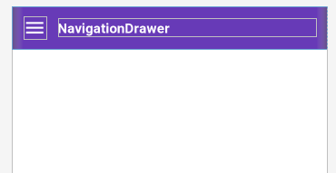
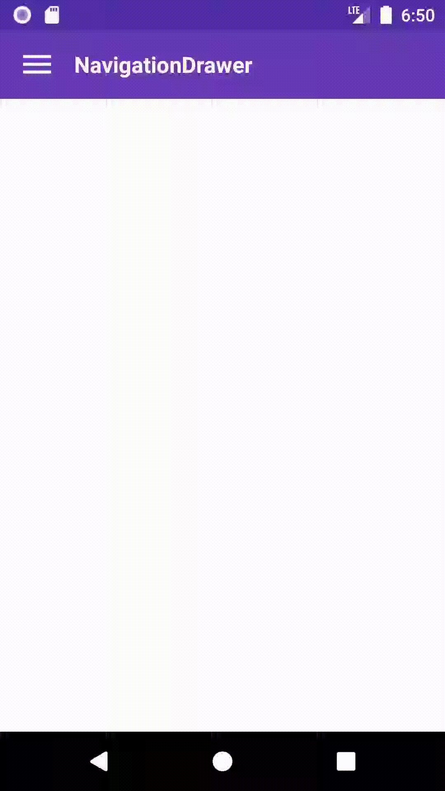

# Navigation Drawer
- Criar um novo projeto com o template `Empty Activity`
- Adicionar em `build.gradle (Module:app)` e sincronizar o projeto:
```javascript

dependencies {
    ...
    //Material Design
    implementation 'com.google.android.material:material:1.2.0'
    //Rounded Image View
    implementation 'com.makeramen:roundedimageview:2.3.0'
    //Navigation component
    implementation 'androidx.navigation:navigation-fragment-ktx:2.2.0-rc03'
    implementation 'androidx.navigation:navigation-ui-ktx:2.2.0-rc03'
}
```

- Modificar o estilo da activity em `values/styles.xml`:
```xml
!-- Base application theme. -->
    <style name="AppTheme" parent="Theme.MaterialComponents.Light.NoActionBar">
        <!-- Customize your theme here. -->
        <item name="colorPrimary">@color/colorPrimary</item>
        <item name="colorPrimaryDark">@color/colorPrimaryDark</item>
        <item name="colorAccent">@color/colorAccent</item>
    </style>
```
- Modificar as cores do app em `values/colors.xml`
```xml
<?xml version="1.0" encoding="utf-8"?>
<resources>
    <color name="colorPrimary">#673AB7</color>
    <color name="colorPrimaryDark">#512DA8</color>
    <color name="colorAccent">#FF5252</color>
    <color name="colorPrimaryText">#212121</color>
    <color name="colorWhite">#FFFFFFF</color>
    <color name="colorGreen">#32CD32</color>
</resources>
```
- Adicionar um ícone no projeto: (`drawable/ic_menu_black_24dp.xml`):
```XML
<vector xmlns:android="http://schemas.android.com/apk/res/android"
        android:width="24dp"
        android:height="24dp"
        android:viewportWidth="24.0"
        android:viewportHeight="24.0">
    <path
        android:fillColor="#FF000000"
        android:pathData="M3,18h18v-2L3,16v2zM3,13h18v-2L3,11v2zM3,6v2h18L21,6L3,6z"/>
</vector>
```
- Adicionar o seguinte codigo em activity_main.xml:

```XML
<?xml version="1.0" encoding="utf-8"?>
<androidx.drawerlayout.widget.DrawerLayout xmlns:android="http://schemas.android.com/apk/res/android"
    xmlns:app="http://schemas.android.com/apk/res-auto"
    xmlns:tools="http://schemas.android.com/tools"
    android:id="@+id/drawerLayout"
    android:layout_width="match_parent"
    android:layout_height="match_parent"
    tools:context=".MainActivity">
    <androidx.constraintlayout.widget.ConstraintLayout
        android:layout_width="match_parent"
        android:layout_height="match_parent">
        <LinearLayout
            android:id="@+id/layoutToolBar"
            android:layout_width="0dp"
            android:layout_height="?actionBarSize"
            android:background="@color/colorPrimary"
            android:orientation="horizontal"
            android:paddingStart="15dp"
            android:gravity="center_vertical"
            android:paddingEnd="15dp"
            app:layout_constraintEnd_toEndOf="parent"
            app:layout_constraintStart_toStartOf="parent"
            app:layout_constraintTop_toTopOf="parent" >
            <ImageView
                android:layout_width="30dp"
                android:layout_height="30dp"
                android:id="@+id/imageMenu"
                android:src="@drawable/ic_menu_black_24dp"
                android:contentDescription="@string/app_name"
                android:tint="@color/colorWhite"
                />
            <TextView
                android:id="@+id/textTitle"
                android:layout_width="match_parent"
                android:layout_height="wrap_content"
                android:layout_marginStart="15dp"
                android:text="@string/app_name"
                android:textColor="@color/colorWhite"
                android:textSize="18sp"
                android:textStyle="bold"
                />
        </LinearLayout>    
    </androidx.constraintlayout.widget.ConstraintLayout>
</androidx.drawerlayout.widget.DrawerLayout>
```
- O layout deve ficar da seguinte maneira:

    

- Agora adicione um navigationView depois do ConstraintLayout:
    ```xml
    ....
        </androidx.constraintlayout.widget.ConstraintLayout>
        <com.google.android.material.navigation.NavigationView
            android:id="@+id/navigationView"
            android:layout_width="wrap_content"
            android:layout_height="match_parent"
            android:layout_gravity="start" />
    </androidx.drawerlayout.widget.DrawerLayout>
    ```
- Execute o app e verique o comportamento, ao arrastar o cursor
da esquerda p/ direita:

   <center></center>

